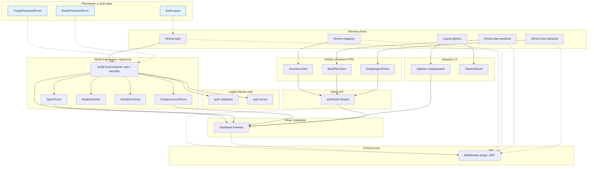

# Architektura UI — logowanie i rejestracja

Źródła: `.ai/prd.md`, `.ai/auth-spec.md`, kod w `src/` (stan na dzień utworzenia diagramu).

<architecture_analysis>

## 1. Komponenty i moduły z dokumentacji oraz kodu

**Strony i layout Astro**

- `layouts/Layout.astro` — szkielet HTML, globalne style, osadza wspólny pasek nawigacji i toasty.
- `pages/login.astro` — strona logowania i rejestracji; przekazuje do React wyłącznie bezpieczne propsy, np. `redirect`.
- Strony chronione: `pages/index.astro` (magazyn `/`), `pages/meal-plan.astro`, `pages/shopping-list.astro` — wymagają sesji zgodnie z PRD i `AUTH_REDIRECT_ROUTES`.

**Komponenty React modułu auth**

- `AuthFormContainer` — stan trybu (logowanie vs rejestracja), pola email i hasła, wysyłka formularzy, komunikaty błędów.
- `SignInForm` — prezentacja pola email, hasła i przycisku logowania.
- `CreateAccountForm` — email, hasło, potwierdzenie hasła, przycisk utworzenia konta.
- `ModeSwitcher` — przełączanie między logowaniem a rejestracją na jednej stronie.
- `InlineErrorArea` — zbiorczy obszar komunikatów błędów z obsługą dostępności.

**Komponenty współdzielone wpływające na auth**

- `AppNav` — linki do sekcji aplikacji oraz wylogowanie przez Supabase.
- `ToasterMount` — globalne powiadomienia toast.

**Logika pomocnicza**

- `lib/auth-validation.ts` — walidacja po stronie klienta przed wywołaniem Supabase.
- `lib/auth-errors.ts` — mapowanie błędów Supabase na teksty dla użytkownika.
- `lib/auth-fetch.ts` — `fetch` z nagłówkiem Bearer i przekierowaniem przy 401.

**Warstwa danych i sesji**

- `db/supabase.browser.ts` — klient przeglądarki, sesja w cookies zgodnie z `@supabase/ssr`.
- `db/supabase.server.ts` — klient serwera do odczytu sesji w middleware.
- `db/supabase.client.ts` — klient z tokenem JWT dla tras API chronionych.

**Middleware i typy**

- `middleware/index.ts` — ochrona tras HTML i API, cookies lub Bearer.
- `types.ts` — `AUTH_REDIRECT_ROUTES`, `isAllowedRedirect`.

**Zakres planowany w auth-spec (jeszcze niekoniecznie w kodzie)**

- `AuthLayout`, strony odzyskiwania hasła, formularze `ForgotPasswordForm` i `ResetPasswordForm`.

## 2. Główne strony i komponenty

| Strona | Główne komponenty React |
|--------|-------------------------|
| `/login` | `AuthFormContainer` → `SignInForm` lub `CreateAccountForm`, `ModeSwitcher`, `InlineErrorArea` |
| `/`, `/meal-plan`, `/shopping-list` | widoki domenowe używające `authFetch` i nawigacji z `AppNav` |

## 3. Przepływ danych

1. Użytkownik wypełnia formularz na `/login` → walidacja lokalna → `signInWithPassword` lub `signUp` przez `supabaseBrowser` → zapis sesji w cookies → przekierowanie do dozwolonej ścieżki.
2. Żądanie HTML do chronionej strony → middleware odczytuje sesję z cookies → brak sesji: przekierowanie na `/login` z parametrem `redirect`.
3. Widoki chronione pobierają dane przez `authFetch` → dołączany jest token z sesji → middleware API weryfikuje Bearer i ustawia `locals` dla handlerów.

## 4. Krótki opis funkcji komponentów

- **AuthFormContainer** — centralny punkt logiki UI logowania i rejestracji oraz obsługi błędów.
- **SignInForm / CreateAccountForm** — tylko prezentacja i zdarzenia formularza, bez bezpośredniego wywołania API poza callbackami z kontenera.
- **AppNav** — nawigacja po zalogowaniu i bezpieczne zakończenie sesji.
- **authFetch** — spójne wywołania chronionych endpointów zgodnie z PRD dotyczącym API.

</architecture_analysis>

<mermaid_diagram>

</mermaid_diagram>
